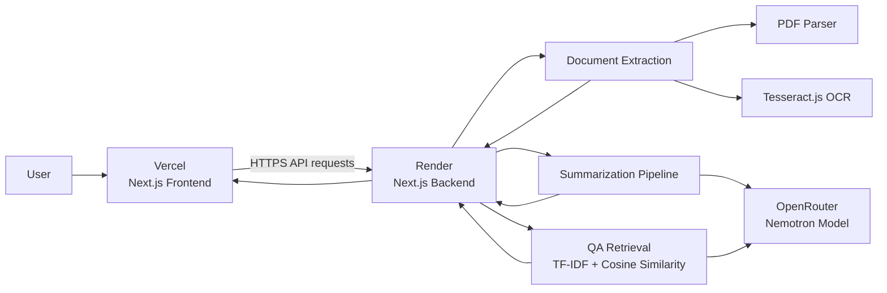

# Document Summarizer

A full-stack document intelligence application that extracts text from PDFs and images, generates structured AI summaries, and lets users ask questions about their documents.

**Live:** https://document-summarizer-smoky.vercel.app/

## Features

- Upload PDF and image documents
- Hybrid PDF text extraction with OCR fallback for scanned or low-quality pages
- OCR using Tesseract.js
- Text quality checks and normalization
- Short, medium, and long AI-generated summaries
- Structured summaries with title, document type, key points, main ideas, entities, and action items
- Automatic suggested questions
- Document Q&A grounded in relevant document chunks using TF-IDF and cosine similarity
- Summary history stored client-side
- Shareable summary links
- Export summaries as PDF
- Client- and server-side file validation
- Production deployment with Vercel and Render

## Architecture



### Request flow

1. The user uploads a PDF or image through the Next.js frontend.
2. The frontend sends the file to the Render backend `/api/extract` endpoint.
3. PDFs are processed with native extraction first; pages requiring better recovery are passed through OCR. Images are processed directly with OCR.
4. Extracted text is sent to `/api/summarize` for structured AI summarization.
5. For Q&A, the backend splits the document into overlapping chunks, ranks relevant chunks with TF-IDF/cosine similarity, and sends the selected context to the AI model.
6. Results are returned to the Vercel frontend for display, history, sharing, and export.

## Tech Stack

### Frontend

- Next.js 16
- React 19
- TypeScript
- Tailwind CSS
- Vercel

### Backend

- Next.js API Routes
- Node.js runtime
- TypeScript
- `pdf-parse` for PDF extraction
- Tesseract.js for OCR
- OpenRouter for LLM inference
- Vitest for testing
- Render

### AI / NLP

- OpenRouter API
- `nvidia/nemotron-3-super-120b-a12b:free`
- Chunk-based summarization for larger documents
- Structured JSON output for summaries and suggested questions
- TF-IDF weighted term vectors and cosine similarity for document retrieval

## Project Structure

```text
document_summarizer/
├── frontend/                 # Next.js UI deployed on Vercel
│   ├── app/
│   │   ├── history/
│   │   ├── s/
│   │   └── page.tsx
│   ├── components/
│   ├── lib/
│   ├── public/
│   ├── .env.example
│   └── package.json
│
├── backend/                  # API and document-processing service on Render
│   ├── app/api/
│   │   ├── extract/
│   │   ├── summarize/
│   │   └── qa/
│   ├── lib/
│   │   ├── extraction/
│   │   ├── qa/
│   │   └── summarization/
│   ├── types/
│   ├── eng.traineddata
│   ├── .env.example
│   └── package.json
│
└── README.md
```

## API Endpoints

| Method | Endpoint | Purpose |
|---|---|---|
| `POST` | `/api/extract` | Extract text from a PDF or image |
| `POST` | `/api/summarize` | Generate a structured summary |
| `POST` | `/api/qa/questions` | Generate suggested document questions |
| `POST` | `/api/qa/answer` | Answer a question using relevant document context |

All API routes use the Node.js runtime because PDF processing and OCR require Node-compatible APIs and runtime support.

## Local Setup

### Prerequisites

- Node.js 20+ recommended
- npm
- An OpenRouter API key

### 1. Clone the repository

```bash
git clone https://github.com/Janavee01/document_summarizer.git
cd document_summarizer
```

### 2. Start the backend

```bash
cd backend
npm install
cp .env.example .env.local
```

Set your API key in `backend/.env.local`:

```env
AI_API_KEY=your_openrouter_api_key
```

Then run:

```bash
npm run dev
```

The backend will run on `http://localhost:3000` unless the port is changed.

### 3. Start the frontend

In a second terminal:

```bash
cd frontend
npm install
cp .env.example .env.local
```

Set the backend URL:

```env
NEXT_PUBLIC_API_URL=http://localhost:3000
```

Then run:

```bash
npm run dev
```

If both applications are using port 3000, start one of them on another port, for example:

```bash
npm run dev -- -p 3001
```

Then update `NEXT_PUBLIC_API_URL` to match the backend port.

## Production Deployment

The application is deployed as two services.

### Frontend — Vercel

- Repository: `Janavee01/document_summarizer`
- Branch: `main`
- Root Directory: `frontend`
- Framework: Next.js
- Environment variable:

```env
NEXT_PUBLIC_API_URL=https://YOUR-RENDER-BACKEND.onrender.com
```

### Backend — Render

- Repository: `Janavee01/document_summarizer`
- Branch: `main`
- Root Directory: `backend`
- Build command:

```bash
npm install && npm run build
```

- Start command:

```bash
npm start
```

- Environment variable:

```env
AI_API_KEY=your_openrouter_api_key
```

Never commit `.env`, `.env.local`, or real API keys to GitHub.

## Testing

Backend tests can be run with:

```bash
cd backend
npm test
```

Frontend production build:

```bash
cd frontend
npm run build
```

Backend production build:

```bash
cd backend
npm run build
```

## Design Notes

### Hybrid document extraction

PDF pages are evaluated for extraction quality. Pages with usable native text avoid unnecessary OCR, while suspicious or scanned pages are processed with Tesseract.js. This improves support for both normal digital PDFs and scanned documents.

### Chunked summarization

Documents that fit within a single model request can be summarized directly. Larger documents are divided into chunks, summarized independently, and then combined into a final structured summary. This reduces prompt size and makes longer documents more manageable.

### Grounded document Q&A

The Q&A system creates overlapping text chunks and represents them with TF-IDF term vectors. The user's question is converted into the same representation, and cosine similarity is used to retrieve the most relevant chunks. Only the selected excerpts are provided to the language model, helping keep answers grounded in the uploaded document without requiring an external vector database.

## Security and Reliability

- API keys are kept on the backend and are never exposed to the browser.
- Uploaded files are validated again on the server before processing.
- API routes return controlled error messages instead of internal stack traces.
- AI requests have timeouts to prevent indefinitely hanging requests.
- Structured AI responses are validated before being returned to the frontend.
