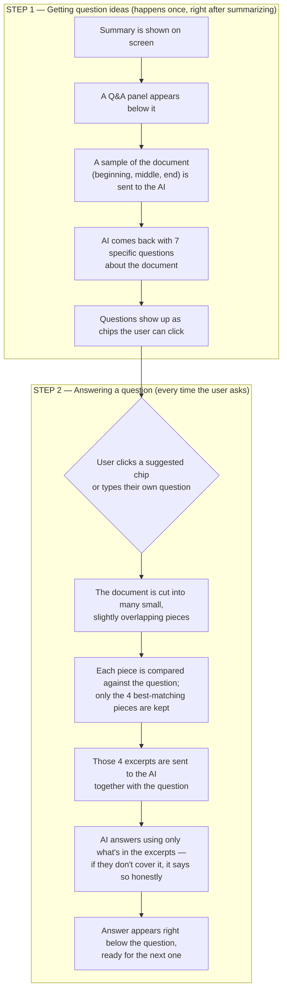

# Document Q&A (Ask Questions About the Document)

## Overview

This feature lets users **ask questions about the uploaded document** and get answers grounded in its actual content. After a summary is generated, an "Ask questions about this document" panel appears below it with:

1. **Suggested questions** — 7 insightful, specific questions pre-generated from the document content, rendered as clickable chips.
2. **Click-to-answer** — clicking a suggested question runs retrieval over the document and displays the AI-generated answer inline.
3. **Free-text asking** — an input box for any custom question about the document.

It uses the **RAG pattern** (Retrieval-Augmented Generation): the document is split into chunks, the chunks most relevant to the question are retrieved via vector search, and only those excerpts are given to the LLM to generate the answer — the same OpenRouter model already used for summarization (`nvidia/nemotron-3-super-120b-a12b:free`). No external embedding service or vector database is needed.

## How It Flows



## Approach

1. **Retrieval core** — `lib/qa/retrieval.ts`
   - Splits the document into overlapping chunks (~1,200 characters each, ~200-character overlap), preferring paragraph/sentence boundaries so chunks don't cut thoughts mid-way. Capped at 400 chunks.
   - Represents every chunk as a **TF-IDF weighted term vector**: term frequencies use sub-linear scaling (`1 + log(count)`) to dampen repetition, and inverse document frequency is computed across all chunks.
   - A query is tokenized into the same kind of vector, then every chunk is scored against it with **cosine similarity**. The top-k chunks (default 4) are returned as the retrieved context.
   - Stop words ("the", "is", "was", …) are filtered out before indexing, and punctuation is stripped during tokenization.

2. **QA core** — `lib/qa/index.ts`
   - `generateSuggestedQuestions(text)` — samples the beginning (~50%), middle (~25%) and end (~25%) of the document up to ~6,000 characters total, so even very large documents stay within prompt limits while remaining fully covered. The model is asked for exactly 7 questions that are *specific* (referencing concrete names, figures, sections from the text) and *answerable from the document alone*, returned as `{ "questions": [...] }` in JSON mode. Questions are normalized to end with a question mark.
   - `answerQuestion(text, question)` — builds a `DocumentIndex`, retrieves the top-4 most relevant chunks for the question, and prompts the model to answer **using only those excerpts**, explicitly instructing it not to invent information and to say so plainly if the excerpts don't contain enough to answer. If vector search somehow returns nothing, it falls back to the document's opening chunk rather than failing.
   - Documents under 80 characters of extracted text are rejected up front — too short to be worth indexing.

3. **Shared JSON helpers** — `lib/summarization/json-utils.ts`
   - The defensive JSON parsing (`extractJson`: strips code fences, falls back to extracting the first balanced `{...}` block) and `toStringArray` normalization previously private to the summarizer were extracted here, so both summarization and QA share one implementation instead of duplicating it.

4. **API routes**
   - `app/api/qa/questions/route.ts` — accepts `POST { text: string }`, returns `{ success: true, data: { questions: string[] } }`.
   - `app/api/qa/answer/route.ts` — accepts `POST { text: string, question: string }`, returns `{ success: true, data: { answer: string, sourcesUsed: number } }`.
   - Both follow the same `{ success, data | error }` response shape as `/api/summarize` and `/api/extract`, run on the Node.js runtime, and set `maxDuration = 60` since LLM calls can be slow.

5. **UI** — `components/summary/document-qa.tsx`
   - Rendered by `components/summary/summary-panel.tsx` directly below the generated summary (only once summarization has succeeded — the feature needs the same extracted text).
   - On first appearance it automatically requests suggested questions (spinner + "Suggesting questions…" while loading). If that fails, an inline error with a **Retry** button appears — the rest of the panel still works, since free-text asking doesn't depend on suggestions.
   - Suggested questions render as pill-shaped chips; clicking one immediately appends it to the conversation and asks it. Already-asked chips are dimmed, and chips are disabled while an answer is pending to prevent overlapping requests.
   - Each exchange renders as question + answer card. While waiting: "Searching the document and generating an answer…" (`aria-live="polite"`). If an answer request fails, the pending entry is removed so the user can retry cleanly, and the error is shown above.
   - The conversation auto-scrolls to the latest answer.

## Error Handling

| Situation | Response | User-facing behavior |
|---|---|---|
| Empty / whitespace-only body, missing `text`, or missing `question` | `400 INVALID_INPUT` | Rejected before any network call is made |
| Document text shorter than 80 characters | `502 QA_FAILED` | "The extracted text is too short to ask questions about." |
| No `AI_API_KEY` configured | `500 CONFIG_ERROR` | Clear message; key is never logged or exposed |
| Network failure reaching OpenRouter | `502 QA_FAILED` | "Could not reach the OpenRouter service." + Retry (suggestions) |
| Non-2xx response from OpenRouter | `502 QA_FAILED` | Upstream detail goes to server logs only; client gets the message |
| Model returns unparseable JSON (suggestions) | `502 QA_FAILED` | "Could not generate suggested questions for this document." |
| Model returns no usable questions | `502 QA_FAILED` | "Could not generate suggested questions for this document." |
| Question isn't answerable from the document | `200` with honest refusal | The LLM states the excerpts don't contain the information — by design, not an error |
| Any unexpected exception | `500 QA_FAILED` | Generic retry message; real error logged server-side only |

All failures return the same `{ success: false, error: { code, message } }` shape handled uniformly by the frontend.

## Why TF-IDF Instead of Embeddings?

True neural embeddings would need either a paid embedding API or extra infrastructure (a vector DB). For single-document Q&A where the corpus fits in memory, sparse TF-IDF vectors with cosine similarity are fast (< milliseconds for hundreds of chunks), dependency-free, and accurate enough to locate the relevant section for a keyword-bearing question. The LLM does the semantic heavy lifting; retrieval just needs to surface the right excerpt(s).

## Configuration

Uses the same environment variable as summarization — nothing new to configure:

```
AI_API_KEY=your-openrouter-api-key
```

